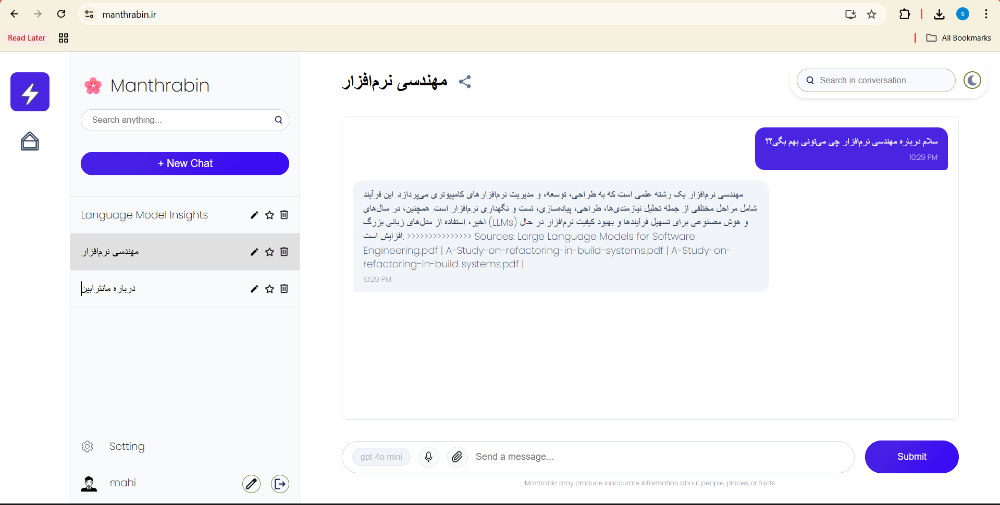
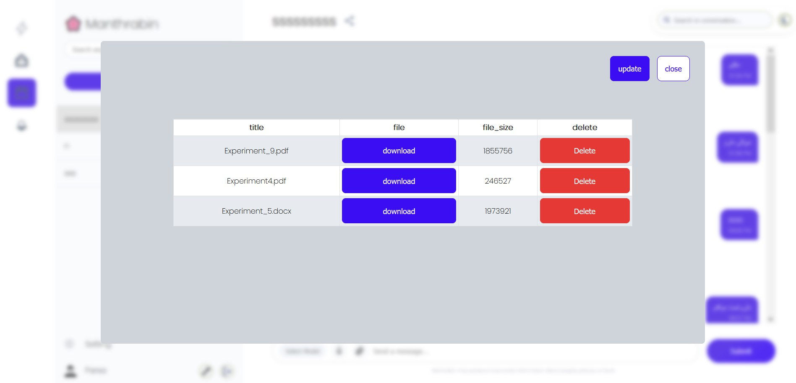

# Manthrabin

**A document-based AI chat assistant for organizational knowledge.**

Manthrabin lets administrators manage a PDF knowledge base and users ask questions backed by retrieved document content. Built by a five-person team for the Software Engineering course at the **University of Isfahan**, this repository contains the Django backend; the React frontend is maintained separately.



## Features and stack

- PDF upload, download, deletion, and vector indexing for an administrator-managed knowledge base.
- Document retrieval and model responses informed by conversation history and user interests.
- JWT-authenticated WebSocket chat, saved conversations, automatic titles, sharing, and search.
- User accounts, password reset, administrator controls, and Redis-based usage limits.

**Stack:** Python 3.12 · Django REST Framework · Channels/Daphne · MariaDB · Elasticsearch · Redis · LangChain · OpenAI · Docker Compose.

PDFs are split into overlapping chunks and embedded into Elasticsearch. The RAG pipeline retrieves relevant passages for each question and passes them to the language model alongside conversation context. MariaDB stores application records; Redis tracks prompt usage.

## Screenshots



These original screenshots come from the final Persian course report and show the team application with its separate frontend.

<details>
<summary>More application screenshots</summary>

| Accounts and preferences | Chat and administration |
| --- | --- |
| [Sign up](docs/screenshots/sign-up.jpg) | [Share by email](docs/screenshots/share-conversation-email.png) |
| [Sign in](docs/screenshots/sign-in.jpg) | [Copy sharing link](docs/screenshots/share-conversation-link.png) |
| [Select interests](docs/screenshots/interests.jpg) | [Manage users](docs/screenshots/user-management.jpg) |
| [Request password reset](docs/screenshots/forgot-password.jpg) | [Disabled account](docs/screenshots/account-disabled.jpg) |
| [Set a new password](docs/screenshots/reset-password.png) | |
| [Edit profile](docs/screenshots/profile.png) | |
| [Change password](docs/screenshots/change-password.png) | |

</details>

## TL;DR setup

With Docker and Compose installed, run from the repository root:

```bash
cp -n .env.example .env
python3 -c "import secrets; print(secrets.token_urlsafe(64))"
```

In `.env`, set `DJANGO_SECRET_KEY` to the generated value, add `OPENAI_API_KEY`, and set `MYSQL_HOST=mysql`, `ES_URL=elasticsearch`, and `REDIS_HOST=redis`.

```bash
docker compose up --build -d --wait backend
curl http://localhost:8000/health/
docker compose exec backend python manage.py createsuperuser
```

Open [Swagger UI](http://localhost:8000/api/docs/). Before creating a conversation, add a model record using the command in [Run locally](#run-locally). The React frontend is separate.

## Run locally

Requires Docker Engine, Docker Compose, and an OpenAI API key. Container images use the `docker.mobinhost.com` mirror.

**1. Configure:** from the repository root, copy the example if `.env` does not already exist:

```bash
cp .env.example .env
```

Set `OPENAI_API_KEY` and replace `DJANGO_SECRET_KEY` with a random secret of at least 50 characters. For Compose, set `MYSQL_HOST=mysql`, `ES_URL=elasticsearch`, and `REDIS_HOST=redis`. Keep the example’s local allowed hosts and matching database names. `CSRF_TRUSTED_ORIGINS` can remain empty locally; additional origins must include their scheme.

Generate a secret with local Python:

```bash
python3 -c "import secrets; print(secrets.token_urlsafe(64))"
```

`JINA_API_TOKEN` enables fetching links included in questions. Email features require `EMAIL_HOST_USER` and `EMAIL_HOST_PASSWORD`. Keep credentials in the Git-ignored `.env` file.

**2. Start:** the following launches the backend and its three supporting services, without the frontend:

```bash
docker compose up --build -d backend
curl http://localhost:8000/health/
docker compose exec backend python manage.py createsuperuser
```

Once startup completes, a healthy backend returns `{"status": "ok"}`. Open [Swagger UI](http://localhost:8000/api/docs/), [ReDoc](http://localhost:8000/api/redoc/), or [Django admin](http://localhost:8000/admin/).

**3. Prepare a conversation:** a fresh database needs a model record. Replace `YOUR_MODEL_ID` with a chat-model identifier available to the configured API account:

```bash
docker compose exec backend python manage.py shell -c "from conversations.models import LLMModel; LLMModel.objects.get_or_create(name='YOUR_MODEL_ID')"
```

Use Swagger to sign in, authorize requests, upload a PDF as an administrator, and create a conversation. Chat connects to `ws://localhost:8000/chat/<conversation_public_id>/` using a JWT in the `Authorization: Bearer <token>` header. The graphical interface requires the separate frontend.

## Development and status

Code is organized into `users/`, `documents/`, `conversations/`, and `rag_utils/`; Django configuration lives in `manthrabin_backend/`.

```bash
docker compose logs --tail 100 backend                    # Startup logs
docker compose exec backend python manage.py test users conversations
docker compose down                                     # Stop; retain data volumes
```

Tests require configured services and permission to create a test database. The course report records 15 passing frontend tests across 5 suites; those are historical results. Local Docker startup and HTTP 200 from `/health/` have been verified, but end-to-end AI chat and the current test suite have not.

This is a course-project demo: startup generates/applies migrations and rebuilds conversation search indexes, the server uses Django’s development command, and WebSocket answers are buffered before delivery. Reminder and task-generation tools were not completed.

## Team credits

**Software Engineering Group 5** collaborated on the project with the following responsibilities:

| Teammate | Role and contributions |
| --- | --- |
| [Sepehr Fatemi](https://github.com/Sepehr-spm) | **Project lead:** chat interface and history, frontend/backend integration, and user APIs |
| [Parsa Khoshnama](https://github.com/ParsaKhoshnama) | **Frontend lead:** document-management and user-administration interfaces |
| [Shima Maghzi](https://github.com/Shimaghzi) | **Backend lead:** WebSocket chat, Redis usage limits, conversation APIs, and user-management APIs |
| [Arshia Shafiei](https://github.com/arshiashafiei) | **DevOps lead, backend and AI integration contributor:** substantial work on AI integration, backend/frontend Dockerization, deployment, document-upload APIs, and Elasticsearch conversation/prompt search |
| [Mohammad Hossein Hashemi](https://github.com/MHTrXz) | **AI lead:** response pipelines combining document retrieval, chat history, user interests, and supplied web links |

The team deployed the application at `manthrabin.ir` during the course project; current availability is not confirmed.
